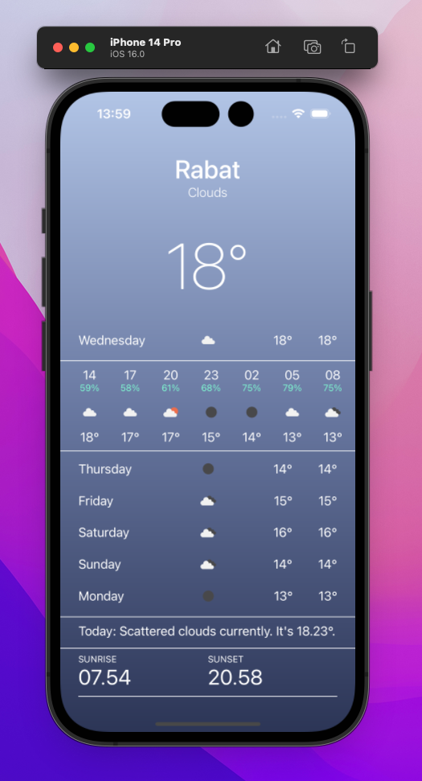

# Application météo iOS avec SwiftUI - Aya EL HADDAJ

## Aperçu
`iOS WeatherApp` est une reproduction du design de l'`Application Météo d'Apple` qui utilise [l'API Openweathermap](https://openweathermap.org/api) et est construite avec SwiftUI. Les fonctionnalités de cette application sont similaires à celles de l'application météo d'Apple, comme l'obtention de la météo actuelle et ses détails, les prévisions météo horaires et les prévisions quotidiennes. Les détails ne sont pas entièrement identiques en raison des fonctionnalités limitées du plan gratuit de l'API Openweathermap.

### Mots-clés
- SwiftUI
- JSON & Codable
- MVVM
- ObservableObject

## Pour commencer
### Prérequis
- Une clé API valide d'Openweathermap
- Un Mac fonctionnant sous macOS Catalina
- Xcode 11.3.1

### Installation
1. Clonez ou téléchargez le projet sur votre machine locale
2. Ouvrez le projet dans Xcode
3. Remplacez `YOURAPIKEY` par votre clé API Openweathermap valide dans `OpenweathermapAPIClient.swift`
```swift
class OpenweathermapClient {
    private let apiKey = "YOURAPIKEY"
```
4. Remplacez `cityId` par l'ID de la ville que vous souhaitez utiliser dans `WeatherViewModel.swift`. Vous pouvez télécharger la liste des villes au format JSON [ici](http://bulk.openweathermap.org/sample/). Dans notre projet, la ville est **Rabat**.
```swift
class WeatherViewModel: ObservableObject {
    private let cityId = "2538475"
```
5. Lancez le simulateur

## Librairies
- Bibliothèque Apple [SwiftUI](https://developer.apple.com/xcode/swiftui/)
- API opensource de [OpenWeatherMap](https://openweathermap.org/api)

## Interface


